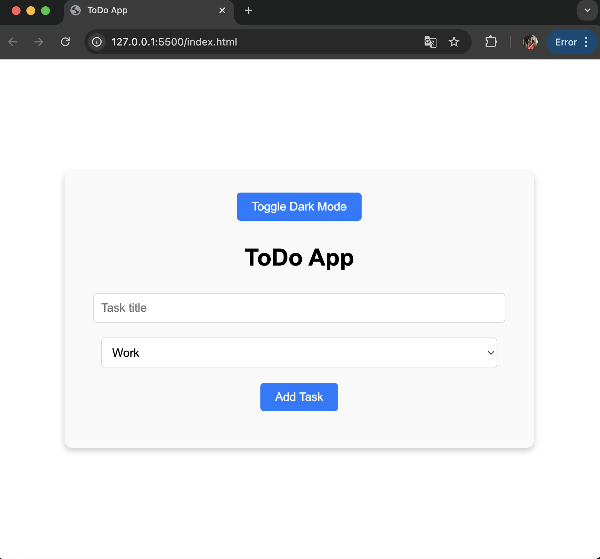
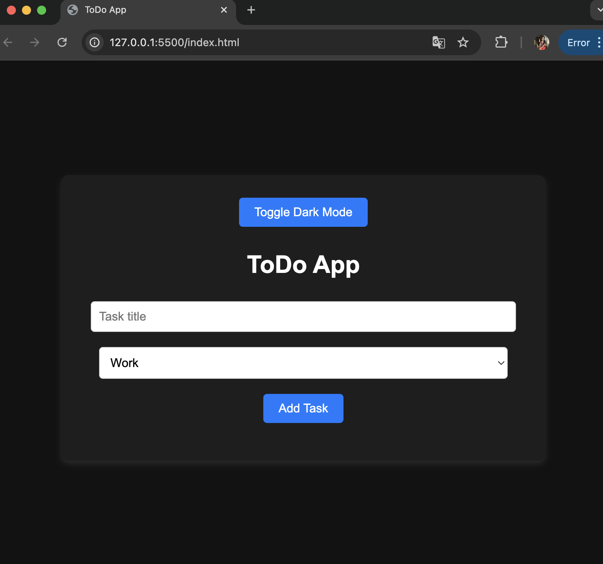

# ToDo App

A simple, user-friendly ToDo app that helps you manage your tasks efficiently. Includes features like categories, dark mode, and task deletion.

## Features
- Add tasks with categories (Work, Personal, Shopping).
- Toggle between light and dark mode for better user experience.
- Delete tasks once completed.
- User-friendly interface designed for simplicity.

## Technologies Used
- HTML
- CSS
- JavaScript

## How to Use
1. Clone this repository to your local machine:
   ```bash
   git clone https://github.com/chennoju18/ToDo-App.git
2. Navigate to the project folder:
   cd ToDo-App
3. Open the index.html file in your browser to use the app.

## Screenshots

### Homepage


### Adding a Task


### Dark Mode


## Live Demo

Check out the live version of this app here:  
[Live Demo](https://chennoju18.github.io/ToDo-App/)

## Conclusion
This app was built to demonstrate JavaScript, CSS, and HTML integration for a functional ToDo App.
